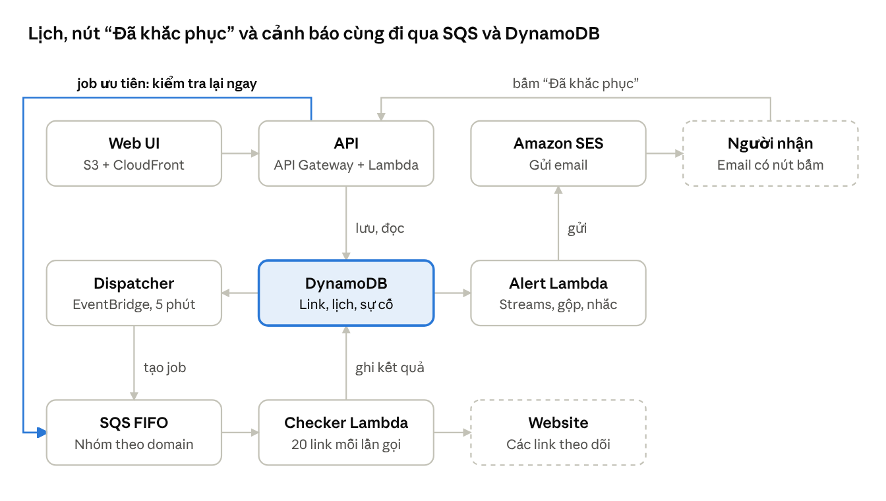
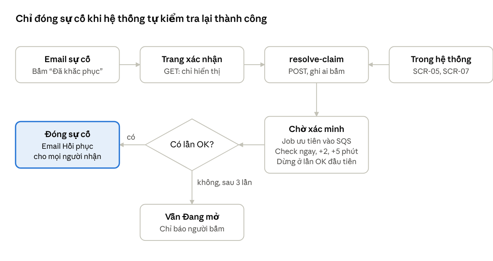

# LinkWatch — Phân tích yêu cầu, HLR & SRS

29/09/2026 · Helen Nguyen

> Bản gốc (living doc, có sơ đồ tương tác): https://claude.ai/code/artifact/ceda111b-7f2a-497b-a771-de2709d90ee2
> Wireframe: https://claude.ai/artifact/AQYJpWDzkSktgbdFCvtJfo
> File này là bản chụp trong repo; khi hai bên khác nhau, bản gốc là chuẩn.

## 1. Phân tích yêu cầu

LinkWatch là công cụ web theo dõi một danh sách link, gom theo domain chính, kiểm tra định kỳ theo tần suất cấu hình được và gửi email cho người liên quan khi link chết hoặc site down.

**Yêu cầu gốc tách thành 5 nhu cầu:**

| # | Nhu cầu | Diễn giải |
| --- | --- | --- |
| 1 | Kiểm tra link | Xác định từng link còn sống, chết (404/410…) hay site down (timeout, DNS, 5xx, SSL) |
| 2 | Nhóm theo domain | Link được gom tự động theo domain gốc (vd. `shop.abc.com/x` → `abc.com`) để xem sức khỏe theo site |
| 3 | Lịch kiểm tra | Mặc định toàn hệ thống 1 lần/ngày lúc 06:00; một số domain/link được đặt tần suất cao hơn (vd. 15 phút) hoặc thấp hơn (vd. hàng tuần) |
| 4 | Cảnh báo email | Khi phát hiện sự cố, gửi email cho người liên quan của domain/link đó |
| 5 | Nền web | Có giao diện web để quản lý link, lịch, người nhận và xem kết quả |

**Điểm còn mơ hồ và giả định đã chọn** (xác nhận ở mục 7.3):

- "Chết" vs "down": coi *link chết* là trang trả 404/410 hoặc chuyển hướng sai; *site down* là không kết nối được, timeout, lỗi DNS/SSL hoặc 5xx.
- "Domain chính": dùng domain đăng ký (eTLD+1), gộp mọi subdomain; cho phép admin tách riêng khi cần.
- "Người liên quan": mỗi domain có danh sách người nhận; link có thể thêm người nhận riêng; luôn có email admin mặc định.
- Tần suất: ưu tiên Link > Domain > Mặc định hệ thống.
- Chống báo nhầm: chỉ báo sự cố sau 2 lần lỗi liên tiếp, và gửi email khi hồi phục.
- Múi giờ mặc định Asia/Saigon (UTC+7).
- Quy mô giả định: tới 5.000 link, 500 domain, dùng nội bộ (5–20 người dùng).

## 2. High-Level Requirements (HLR)

Hệ thống có 10 HLR; 8 HLR đầu thuộc MVP, 2 HLR cuối để giai đoạn 2.

| Mã | Yêu cầu mức cao | Ưu tiên |
| --- | --- | --- |
| HLR-01 | Hệ thống cho phép quản lý danh sách link cần theo dõi: thêm từng link, nhập hàng loạt (CSV/dán danh sách), sửa, tạm dừng, xóa. | Must |
| HLR-02 | Hệ thống tự động nhóm link theo domain chính và hiển thị trạng thái tổng hợp của từng domain. | Must |
| HLR-03 | Hệ thống kiểm tra từng link và phân loại kết quả: Hoạt động, Chậm, Link chết, Site down. | Must |
| HLR-04 | Hệ thống chạy kiểm tra định kỳ với lịch mặc định 06:00 hàng ngày cho toàn bộ link. | Must |
| HLR-05 | Người dùng có thể ghi đè tần suất kiểm tra cho từng domain hoặc từng link (cao hơn hoặc thấp hơn mặc định). | Must |
| HLR-06 | Hệ thống gửi email cảnh báo tới người liên quan khi phát hiện sự cố, và email thông báo khi hồi phục. | Must |
| HLR-07 | Người dùng có thể cấu hình người nhận cảnh báo theo domain và theo link. | Must |
| HLR-08 | Hệ thống lưu lịch sử kiểm tra và sự cố, cho phép xem, lọc và kiểm tra thủ ("Check now"). | Must |
| HLR-09 | Hệ thống có đăng nhập và phân quyền (Admin, Editor, Viewer). | Should |
| HLR-10 | Hệ thống gửi báo cáo tổng hợp hàng ngày/tuần và hỗ trợ kênh cảnh báo khác (Slack, Teams, Telegram). | Could |

## 3. SRS — Giới thiệu và mô tả tổng quan

### 3.1 Mục đích và phạm vi

Tài liệu đặc tả yêu cầu phần mềm cho LinkWatch phiên bản 1.0 (MVP), dành cho BA, dev, QA và người vận hành.

- **Trong phạm vi:** quản lý link/domain, kiểm tra HTTP(S) định kỳ, phân loại trạng thái, cảnh báo email, lịch sử, dashboard, phân quyền cơ bản.
- **Ngoài phạm vi v1.0:** crawl tìm link con, kiểm tra nội dung/visual, kiểm tra từ nhiều vùng địa lý, kênh Slack/Teams/SMS, trang status công khai.

### 3.2 Thuật ngữ

| Thuật ngữ | Định nghĩa |
| --- | --- |
| Link (Monitor) | Một URL cần theo dõi |
| Domain chính | Domain đăng ký (eTLD+1) của URL, vd. `blog.abc.com.vn` → `abc.com.vn` |
| Check | Một lần gửi request tới link và ghi nhận kết quả |
| Incident (sự cố) | Khoảng thời gian link ở trạng thái lỗi đã xác nhận, từ lúc mở đến lúc hồi phục |
| Lịch (Schedule) | Tần suất kiểm tra: giờ cố định (cron) hoặc chu kỳ (mỗi N phút/giờ) |

### 3.3 Tác nhân

| Tác nhân | Quyền chính |
| --- | --- |
| Admin | Toàn quyền: người dùng, cấu hình email gửi, lịch mặc định, mọi domain/link |
| Editor | Thêm/sửa link, domain, lịch riêng, người nhận; xác nhận (acknowledge) sự cố |
| Viewer | Xem dashboard, lịch sử, báo cáo |
| Người nhận cảnh báo | Nhận email; không cần tài khoản |
| Scheduler (hệ thống) | Kích hoạt kiểm tra theo lịch |

### 3.4 Kiến trúc tổng quan

LinkWatch chạy hoàn toàn serverless trên AWS, không có máy chủ cần trả tiền theo giờ; với 5.000 link, chi phí ước tính nằm trong hạn mức miễn phí vĩnh viễn của Lambda, DynamoDB và EventBridge. Sơ đồ dưới thể hiện luồng dữ liệu, gồm cả luồng người nhận bấm "Đã khắc phục" trong email (mục 4.8).



DynamoDB là trung tâm: Dispatcher đọc link đến hạn, Checker ghi kết quả, Alert Lambda nhận thay đổi trạng thái qua DynamoDB Streams để gửi email; khi người nhận bấm "Đã khắc phục", API đẩy job ưu tiên vào SQS để kiểm tra lại ngay. Khung nét đứt là bên ngoài AWS.

**Dịch vụ và hạn mức miễn phí** (số liệu gần đúng, cần kiểm tra lại trên trang giá AWS trước khi triển khai):

| Thành phần | Dịch vụ AWS | Hạn mức miễn phí | Tải ước tính (5.000 link) |
| --- | --- | --- | --- |
| Web UI | S3 + CloudFront | CloudFront 1 TB/tháng, 10 triệu request | < 1 GB/tháng |
| API | API Gateway (HTTP API) + Lambda | API Gateway miễn phí 12 tháng đầu, sau đó khoảng 1 USD/triệu request | < 100.000 request/tháng |
| Đăng nhập | Amazon Cognito | Khoảng 10.000 người dùng hoạt động/tháng | 5–20 người |
| Lịch | EventBridge Scheduler → Dispatcher Lambda, mỗi 5 phút | 14 triệu lượt gọi/tháng | 8.640 lượt/tháng |
| Hàng đợi | SQS | 1 triệu request/tháng | khoảng 150.000 |
| Kiểm tra | Lambda (Checker), mỗi lần gọi check song song 20 link | 1 triệu lượt gọi + 400.000 GB-giây/tháng | khoảng 75.000 lượt, 190.000 GB-giây |
| Dữ liệu | DynamoDB, chế độ provisioned 25 WCU / 25 RCU | 25 GB + 25 WCU/RCU | khoảng 1,6 triệu bản ghi/tháng, TTL 90 ngày |
| Cảnh báo | DynamoDB Streams → Alert Lambda → SES | SES: khoảng 3.000 email/tháng trong 12 tháng đầu, sau đó 0,10 USD/1.000 email | vài trăm email/tháng |
| Giám sát | CloudWatch Logs (giữ 14 ngày) + AWS Budgets 1 USD | 5 GB log/tháng | < 1 GB |

**Quy tắc bắt buộc để giữ chi phí gần 0:**

- Lambda chạy **ngoài VPC** để ra internet trực tiếp; không dùng NAT Gateway (khoảng 32 USD/tháng).
- Không dùng RDS/PostgreSQL, EC2 hay ElastiCache; DynamoDB thay cho cơ sở dữ liệu quan hệ.
- SQS FIFO với `MessageGroupId = domain` để giới hạn tải lên từng domain; Checker giới hạn reserved concurrency (vd. 10).
- Bật AWS Budgets cảnh báo khi chi phí dự kiến vượt 1 USD/tháng.
- Domain riêng (vd. mua ở Cloudflare, DNS miễn phí) để xác thực SES bằng DKIM/SPF/DMARC; xin ra khỏi SES sandbox trước khi gửi thật.

**Rủi ro cần biết:** một số website chặn dải IP của AWS bằng WAF, dẫn tới báo "down" nhầm; cách xử lý là cho phép đánh dấu "bỏ qua mã 403 từ WAF" theo domain. Công nghệ build chi tiết ở mục 3.5.

### 3.5 Công nghệ build

**Chốt: TypeScript cho toàn bộ hệ thống** — frontend, Lambda và hạ tầng (IaC) cùng một ngôn ngữ, dùng chung kiểu dữ liệu và schema kiểm tra đầu vào, nên một dev có thể làm cả hai đầu. Node.js trên Lambda khởi động nhanh và xử lý nhiều request HTTP song song tốt, hợp với việc check 20 link mỗi lần gọi.

| Lớp | Công nghệ chọn | Lý do | Phương án thay thế |
| --- | --- | --- | --- |
| Ngôn ngữ | TypeScript 5, Node.js 22 LTS | Một ngôn ngữ cho FE/BE/IaC | Python 3.12 cho backend |
| Frontend | Next.js 16 (App Router, static export) | Build ra file tĩnh, host trên S3 + CloudFront, không cần server | OpenNext trên Lambda nếu sau này cần SSR |
| UI | Mantine (bảng, form, modal, thông báo có sẵn) | Nhiều bảng dữ liệu, làm nhanh | Tailwind + shadcn/ui |
| Dữ liệu phía FE | TanStack Query, React Hook Form + Zod (điều hướng dùng App Router của Next.js) | Cache, tự refresh trạng thái, form có kiểm tra | SWR |
| Biểu đồ | Recharts | Thời gian phản hồi, thanh uptime | ECharts |
| Đa ngôn ngữ | react-i18next (vi mặc định, en) | NFR-10 | — |
| Đăng nhập | Amazon Cognito + `aws-amplify/auth` (chỉ module auth) | JWT, API Gateway xác thực sẵn, miễn phí quy mô nhỏ | Auth0 free |
| API | 1 Lambda "API" dùng Hono sau API Gateway HTTP API (JWT authorizer) | Một hàm cho mọi route: ít cold start, dễ debug | Mỗi route một Lambda |
| Kiểm tra đầu vào | Zod (schema dùng chung FE/BE) | Một nguồn sự thật cho kiểu dữ liệu | Valibot |
| Checker | `undici` (fetch có timeout, giới hạn redirect), `tldts` (tách domain chính theo Public Suffix List), `p-limit`, module `tls` đọc hạn SSL | Đáp ứng FR-07, FR-17, 5.1 | `got` |
| Truy cập DynamoDB | ElectroDB (single-table) + AWS SDK v3 | Khai báo entity, key và GSI theo mục 6.2, có kiểu | DynamoDB Toolbox |
| Email | SES v2 SDK + React Email (gói `react-email`) | Mẫu email viết bằng component, hiển thị tốt trên Outlook/Gmail | MJML |
| Tiện ích Lambda | Powertools for AWS Lambda (TypeScript): Logger, Metrics, Tracer, Idempotency | Log JSON, chống xử lý trùng job SQS (FR-40) | Middy |
| Cấu hình, bí mật | SSM Parameter Store (Standard, miễn phí) | Lưu khóa ký token, cấu hình; không dùng Secrets Manager (có phí) | — |
| Hạ tầng (IaC) | AWS CDK v2 (TypeScript), đóng gói Lambda bằng esbuild, kiến trúc arm64 | Cùng ngôn ngữ, công cụ chính hãng AWS; arm64 rẻ hơn khoảng 20% | SST, AWS SAM |
| Repo | Monorepo pnpm workspaces | Chia sẻ schema, entity, mẫu email | Nx, Turborepo |
| Kiểm thử | Vitest (unit), aws-sdk-client-mock, DynamoDB Local (Docker) cho integration, Playwright (E2E, gồm trang xác nhận SCR-10) | Nhanh, cùng hệ TypeScript | Jest |
| Chất lượng code | Biome (lint + format), TypeScript strict | Một công cụ, chạy nhanh | ESLint + Prettier |
| CI/CD | GitHub Actions, đăng nhập AWS bằng OIDC (không lưu access key); `cdk diff` khi mở PR, `cdk deploy` khi merge | Miễn phí cho repo nhỏ, an toàn | GitLab CI |
| Môi trường | 2 stage `dev` và `prod` (cùng tài khoản AWS, tách bằng tên stack) | Giữ chi phí 0 | 2 tài khoản AWS qua AWS Organizations |

**Cấu trúc repo:**

```
link-watch/
├─ apps/web/            Next.js static export (SCR-01 … SCR-10)
├─ services/
│  ├─ api/              Hono: link, domain, lịch, sự cố, resolve-claim
│  ├─ dispatcher/       EventBridge 5 phút → lấy link đến hạn → SQS
│  ├─ checker/          SQS → check 20 link → ghi kết quả, mở/đóng sự cố
│  └─ alert/            DynamoDB Streams → gộp, nhắc lại → SES
├─ packages/
│  ├─ core/             Zod schema, ElectroDB entity, logic phân loại 5.1 và xác minh 5.2
│  └─ emails/           Mẫu React Email: Sự cố, Hồi phục, Vẫn lỗi, Nhắc lại
├─ infra/               AWS CDK: stack, quyền IAM, Budgets 1 USD
└─ docs/                Tài liệu (file này)
```

**Next.js ở chế độ static export:** `next build` xuất thư mục `out/` gồm HTML/JS tĩnh, đưa lên S3 + CloudFront nên không tốn tiền server. Đổi lại, không dùng được Server Actions, Route Handlers, middleware và ISR; mọi dữ liệu lấy từ API Hono phía client. Trang có tham số dùng query string thay cho route động: `/domains/?d=abc.com.vn`, `/links/detail/?id=…`, `/confirm/?token=…` (SCR-10). CloudFront cần một CloudFront Function nhỏ để chuyển `/links/` thành `/links/index.html`.

**Ảnh hưởng tới yêu cầu:** dùng SES qua IAM nên FR-26 đổi từ "cấu hình SMTP" thành "chọn địa chỉ gửi đã xác thực trên SES và gửi email thử"; không cần lưu mật khẩu SMTP. Ước lượng MVP với 1–2 dev quen TypeScript và AWS: 4–6 tuần như mục 7.2.

## 4. SRS — Yêu cầu chức năng

Mỗi FR truy vết về một HLR; màn hình liên quan nằm trong wireframe (SCR-xx).

Wireframe 10 màn hình: [LinkWatch Wireframe](https://claude.ai/artifact/AQYJpWDzkSktgbdFCvtJfo) — SCR-01 Tổng quan, SCR-02 Domain, SCR-03 Link, SCR-04 Thêm/nhập, SCR-05 Chi tiết link, SCR-06 Lịch, SCR-07 Sự cố, SCR-08/09 Cài đặt, SCR-10 Trang xác nhận "Đã khắc phục" (mobile), và mẫu email.

### 4.1 Quản lý link (HLR-01) — SCR-03, SCR-04

| Mã | Yêu cầu |
| --- | --- |
| FR-01 | Thêm link: URL (bắt buộc, http/https, ≤ 2.048 ký tự), tên hiển thị, tag, phương thức (GET/HEAD, mặc định GET), mã HTTP mong đợi (mặc định 200–399), timeout (mặc định 30 giây), từ khóa bắt buộc có trong nội dung (tùy chọn). |
| FR-02 | Chuẩn hóa URL trước khi lưu (bỏ khoảng trắng, hạ chữ thường host, bỏ `#fragment`) và chặn trùng lặp. |
| FR-03 | Nhập hàng loạt bằng CSV hoặc dán danh sách (mỗi dòng một URL), tối đa 1.000 dòng/lần; hiển thị xem trước: hợp lệ / trùng / lỗi. |
| FR-04 | Sửa, tạm dừng/tiếp tục, xóa (mềm) một hoặc nhiều link; link tạm dừng không được kiểm tra và không cảnh báo. |
| FR-05 | Xuất danh sách link và trạng thái hiện tại ra CSV. |
| FR-06 | Tìm kiếm theo URL/tên; lọc theo domain, trạng thái, tag, lịch. |

### 4.2 Nhóm theo domain (HLR-02) — SCR-01, SCR-02

| Mã | Yêu cầu |
| --- | --- |
| FR-07 | Khi lưu link, tự xác định domain chính bằng Public Suffix List và gán vào domain (tạo mới nếu chưa có). |
| FR-08 | Domain có: tên hiển thị, mô tả, người phụ trách, danh sách người nhận, lịch riêng, trạng thái bật/tắt. |
| FR-09 | Trạng thái tổng hợp domain: **Down** nếu ≥ 1 link Site down; **Có lỗi** nếu ≥ 1 link chết; **Cảnh báo** nếu ≥ 1 link chậm; ngược lại **Bình thường**. |
| FR-10 | Hiển thị theo domain: số link theo từng trạng thái, uptime 7/30 ngày, thời gian phản hồi trung bình, lần kiểm tra gần nhất và kế tiếp. |

### 4.3 Lịch kiểm tra (HLR-04, HLR-05) — SCR-06

| Mã | Yêu cầu |
| --- | --- |
| FR-11 | Lịch mặc định hệ thống: hàng ngày 06:00 Asia/Saigon; Admin sửa được. |
| FR-12 | Tạo lịch mẫu (profile) để tái sử dụng. Kiểu: *Chu kỳ* (mỗi 5/15/30 phút, 1/6/12 giờ) hoặc *Giờ cố định* (hàng ngày lúc HH:mm, ngày trong tuần, ngày trong tháng). Chu kỳ tối thiểu 5 phút. |
| FR-13 | Gán lịch cho domain hoặc link. Thứ tự ưu tiên: Link > Domain > Mặc định. UI hiển thị lịch hiệu lực và nguồn kế thừa. |
| FR-14 | Scheduler dàn đều các check cùng mốc giờ (jitter ≤ 5 phút) và giới hạn tối đa 2 request đồng thời trên mỗi domain. |
| FR-15 | Khung bảo trì: đặt khoảng thời gian tắt cảnh báo cho domain/link (vẫn kiểm tra, không gửi email). |

### 4.4 Kiểm tra thủ và lịch sử (HLR-08) — SCR-05, SCR-07

| Mã | Yêu cầu |
| --- | --- |
| FR-16 | "Check now" cho một link, cả domain hoặc tập link đã chọn; kết quả hiển thị trong ≤ 60 giây. |
| FR-17 | Mỗi lần check lưu: thời điểm, mã HTTP, thời gian phản hồi (ms), URL cuối sau redirect, loại lỗi, thông điệp lỗi, hạn chứng chỉ SSL. |
| FR-18 | Trang chi tiết link: biểu đồ thời gian phản hồi, thanh uptime 30 ngày, bảng 100 lần check gần nhất, danh sách sự cố. |
| FR-19 | Trang sự cố: danh sách đang mở/đã đóng, thời lượng, nguyên nhân, người đã nhận email; Editor có thể Acknowledge và ghi chú. |

### 4.5 Cảnh báo và người nhận (HLR-06, HLR-07) — SCR-08

| Mã | Yêu cầu |
| --- | --- |
| FR-20 | Người nhận = hợp của (người nhận link) ∪ (người nhận domain) ∪ (email admin mặc định nếu hai danh sách trên rỗng); loại trùng. |
| FR-21 | Gửi email **Sự cố** khi mở incident và email **Hồi phục** khi đóng incident (kèm thời lượng down). |
| FR-22 | Gộp email: các sự cố cùng domain phát sinh trong 5 phút được gộp thành một email liệt kê từng link. |
| FR-23 | Nhắc lại nếu incident chưa được Acknowledge và vẫn mở: mặc định mỗi 24 giờ, cấu hình được; tắt được. |
| FR-24 | Nội dung email: tên domain, danh sách URL lỗi, loại lỗi, mã HTTP, thời điểm phát hiện, link tới trang sự cố. Tiêu đề dạng `[LinkWatch][DOWN] abc.com — 3 link lỗi`. |
| FR-25 | Ghi log mọi email đã gửi (người nhận, thời điểm, trạng thái gửi); retry 3 lần khi gửi lỗi. |
| FR-26 | Admin chọn địa chỉ gửi đã xác thực trên Amazon SES, tên người gửi, email admin mặc định và gửi email thử (không lưu mật khẩu SMTP). |
| FR-27 | Tùy chọn cảnh báo SSL sắp hết hạn (mặc định trước 14 ngày). |

### 4.6 Người dùng và phân quyền (HLR-09) — SCR-09

| Mã | Yêu cầu |
| --- | --- |
| FR-28 | Đăng nhập bằng email + mật khẩu; tùy chọn SSO Google/Microsoft ở giai đoạn 2. |
| FR-29 | Admin mời, đổi vai trò, vô hiệu hóa người dùng. |
| FR-30 | Nhật ký thao tác (audit log) cho thêm/sửa/xóa link, domain, lịch, người nhận. |

### 4.7 Báo cáo (HLR-10, giai đoạn 2)

| Mã | Yêu cầu |
| --- | --- |
| FR-31 | Email tóm tắt hàng ngày sau lượt check 06:00: tổng link, số lỗi theo domain, sự cố mới/đã đóng. |
| FR-32 | Webhook/Slack/Teams/Telegram làm kênh cảnh báo bổ sung. |

### 4.8 Xác nhận "Đã khắc phục" và kiểm tra lại (HLR-06, HLR-08) — Email, SCR-10, SCR-05, SCR-07

**Đề xuất: dùng cả hai kênh, chung một API.** Email là kênh chính vì người nhận không cần tài khoản và bấm ngay sau khi sửa; trong hệ thống là kênh phụ cho Editor/Admin cần ghi chú và truy vết. Cả hai gọi `POST /incidents/{id}/resolve-claim`, nên logic chỉ viết một lần.

| Phương án | Ưu điểm | Nhược điểm | Kết luận |
| --- | --- | --- | --- |
| Link trong email thực hiện ngay khi mở | 1 lần bấm | Bộ quét link của Outlook Safe Links, Gmail, phần mềm diệt virus tự mở link → kích hoạt nhầm | Không dùng |
| Link trong email → trang xác nhận → bấm nút | Không cần đăng nhập; an toàn với bộ quét link; xem kết quả ngay | 2 lần bấm; cần token | **Chọn — kênh chính** |
| Nút trong hệ thống (SCR-05, SCR-07) | Có danh tính, audit, ghi chú, xử lý nhiều link một lúc | Phải đăng nhập | **Chọn — kênh phụ** |
| Trả lời email bằng từ khóa | Quen thuộc | Cần SES inbound + phân tích nội dung; chậm, dễ sai, khó xác thực người gửi | Không dùng |

| Mã | Yêu cầu |
| --- | --- |
| FR-33 | Email Sự cố có nút **"Đã khắc phục — kiểm tra lại"** cho từng link, và một nút cho cả nhóm khi email gộp nhiều link. |
| FR-34 | Link chứa token ngẫu nhiên ≥ 128 bit (chỉ lưu bản băm), gắn với incident và email người nhận; hết hạn khi incident đóng hoặc sau 7 ngày. |
| FR-35 | Mở link (GET) chỉ hiển thị trang xác nhận, không thay đổi dữ liệu: URL, loại lỗi, thời điểm, ô ghi chú tùy chọn (vd. "Đã gia hạn SSL"). Nút **"Xác nhận & kiểm tra lại"** gửi POST. |
| FR-36 | Khi POST: ghi `resolve_claim` (ai, lúc nào, kênh, ghi chú), chuyển incident sang **Chờ xác minh**, đẩy job ưu tiên vào SQS cho đúng link đó, bỏ qua lịch và jitter, gửi kèm header chống cache. |
| FR-37 | Xác minh tối đa 3 lần: ngay, sau 2 phút, sau 5 phút, để chờ DNS/CDN cập nhật. Lần đầu tiên thành công → đóng incident với nhãn "Khắc phục bởi <người bấm>", trạng thái link = Hoạt động, gửi email Hồi phục cho mọi người nhận. |
| FR-38 | Cả 3 lần đều lỗi → incident về **Đang mở** với ghi chú "Báo khắc phục nhưng vẫn lỗi" kèm mã lỗi mới; chỉ báo cho người vừa bấm (trên trang và qua email), không gửi lại cho cả nhóm. |
| FR-39 | Trang xác nhận hiển thị kết quả trực tiếp: lần check đầu có kết quả trong ≤ 30 giây, trang tự cập nhật mỗi 3 giây cho đến khi xong 3 lần. |
| FR-40 | Chống lạm dụng: tối đa 1 lần kiểm tra lại mỗi 2 phút cho mỗi link; bấm lặp trong lúc Chờ xác minh chỉ hiển thị tiến độ hiện tại. |
| FR-41 | Nút tương tự trong SCR-05 và SCR-07 cho Editor/Admin, chọn được nhiều link; mọi lần báo khắc phục hiện trên dòng thời gian của sự cố. |
| FR-42 | Nếu lượt check theo lịch đã thành công trước khi có ai bấm, incident tự đóng như mục 5.2; mở link trong email khi đó chỉ báo "Đã hồi phục lúc …". |



Lời báo của người dùng chỉ kích hoạt kiểm tra lại; trạng thái chỉ đổi theo kết quả thật, nên bấm nhầm hoặc sửa chưa xong cũng không làm sai dữ liệu.

## 5. SRS — Logic kiểm tra và quy tắc cảnh báo

Mỗi lần check cho ra một trong 4 kết quả; chỉ kết quả lỗi lặp lại 2 lần liên tiếp mới mở sự cố và gửi email.

### 5.1 Phân loại kết quả một lần check

| Kết quả | Điều kiện | Ví dụ |
| --- | --- | --- |
| Site down | Không nhận được phản hồi hợp lệ: DNS không phân giải, từ chối kết nối, timeout, lỗi SSL, hoặc mã 5xx | `ENOTFOUND`, `ETIMEDOUT`, 502, 503 |
| Link chết | Server trả lời nhưng trang không dùng được: 4xx, mã ngoài danh sách mong đợi, vượt 10 lần redirect, thiếu từ khóa bắt buộc | 404, 410, 403 |
| Chậm | Thành công nhưng thời gian phản hồi vượt ngưỡng (mặc định 5.000 ms) | 200 trong 7,2 giây |
| Hoạt động | Mã nằm trong danh sách mong đợi, dưới ngưỡng chậm | 200, 301 → 200 |

- Request dùng User-Agent `LinkWatch/1.0`, theo redirect, tự thử lại bằng GET nếu HEAD bị 405.
- Chậm chỉ hiển thị cảnh báo vàng trên UI, mặc định không gửi email (bật được theo domain).

### 5.2 Xác nhận sự cố

1. Lần check lỗi đầu tiên → trạng thái *Nghi ngờ*, lên lịch check lại sau 2 phút (không chờ lịch kế tiếp).
2. Lần thứ 2 vẫn lỗi → mở Incident, gửi email Sự cố (áp dụng gộp 5 phút).
3. Trong khi Incident mở, link được check lại mỗi 10 phút trong 1 giờ đầu, sau đó theo lịch gốc hoặc mỗi 1 giờ (lấy mức dày hơn).
4. Check thành công → đóng Incident, gửi email Hồi phục.
5. Nếu ≥ 80% link của toàn hệ thống cùng lỗi trong một lượt, coi là sự cố mạng phía LinkWatch: chỉ gửi 1 email cho Admin, không gửi cho người nhận domain.

## 6. SRS — Yêu cầu phi chức năng và dữ liệu

### 6.1 Yêu cầu phi chức năng

| Mã | Nhóm | Yêu cầu |
| --- | --- | --- |
| NFR-01 | Hiệu năng | Lượt 06:00 với 5.000 link hoàn tất trong ≤ 15 phút |
| NFR-02 | Hiệu năng | Dashboard tải ≤ 2 giây với 500 domain |
| NFR-03 | Độ trễ cảnh báo | Email Sự cố gửi đi ≤ 5 phút sau khi xác nhận lỗi lần 2 |
| NFR-04 | Độ tin cậy | Không bỏ lỡ lượt nào: Dispatcher lấy mọi link có next_run_at ≤ hiện tại, nên lượt bị lỗi sẽ được chạy bù ở lần gọi kế tiếp; job lỗi 3 lần vào SQS dead-letter queue |
| NFR-05 | Khả dụng | Bản thân LinkWatch uptime ≥ 99,5%/tháng; có heartbeat ra ngoài (vd. healthchecks.io) |
| NFR-06 | Mở rộng | Lambda tự mở rộng theo số job trong SQS; tăng thông lượng bằng cách nâng reserved concurrency, không sửa code |
| NFR-07 | Bảo mật | HTTPS, mật khẩu do Cognito quản lý, token trong email chỉ lưu bản băm; chặn check địa chỉ IP nội bộ (SSRF) trừ khi Admin cho phép |
| NFR-08 | Lưu trữ | Chi tiết check giữ 90 ngày, số liệu tổng hợp theo ngày giữ 2 năm, incident giữ vĩnh viễn |
| NFR-09 | Lịch sự | Tôn trọng máy chủ đích: ≤ 2 request đồng thời/domain, không tải tài nguyên phụ |
| NFR-10 | Khả dụng UI | Tiếng Việt (mặc định) và tiếng Anh; hiển thị tốt trên desktop và mobile |

### 6.2 Mô hình dữ liệu chính

Các thực thể domain, monitor (link), schedule, check_result, incident, resolve_claim, recipient, notification, maintenance_window, user, audit_log được lưu trong **một bảng DynamoDB** (single-table), khóa thiết kế theo các truy vấn chính:

| Thực thể | PK | SK | Trường chính |
| --- | --- | --- | --- |
| Domain | `DOMAIN#abc.com.vn` | `META` | display_name, owner, schedule_id, slow_alert, enabled, status tổng hợp |
| Link | `DOMAIN#abc.com.vn` | `LINK#<id>` | url, name, tags, method, expected_codes, timeout_s, keyword, schedule_id, status, paused, next_run_at |
| Kết quả check | `LINK#<id>` | `CHECK#<thời điểm>` | http_code, response_ms, final_url, result, error_type, ssl_expires_at, **ttl = +90 ngày** |
| Sự cố | `LINK#<id>` | `INC#<opened_at>` | type, state (Đang mở / Chờ xác minh / Đã đóng), closed_at, closed_reason, acked_by |
| Báo khắc phục | `INC#<id>` | `CLAIM#<thời điểm>` | by_email, channel (email / app), note, verify_attempts, outcome |
| Token email | `TOKEN#<sha256>` | `META` | incident_id, link_id, recipient_email, **ttl = 7 ngày** |
| Người nhận | `DOMAIN#…` hoặc `LINK#…` | `RCP#<email>` | name |
| Email đã gửi | `INC#<id>` | `MAIL#<thời điểm>` | kind (down / recovery / reminder / verify_failed), to, status, retries |
| Lịch mẫu, bảo trì, người dùng, audit | `SCHED#…`, `MAINT#…`, `USER#…`, `AUDIT#<ngày>` | — | như mô tả ở FR |

**Chỉ mục phụ (GSI):** `GSI1` = `due` / `next_run_at` để Dispatcher lấy link đến hạn; `GSI2` = `state` / `opened_at` để liệt kê sự cố đang mở. Số liệu uptime theo ngày được Checker cộng dồn vào `LINK#<id>` / `DAY#<ngày>` để giữ 2 năm mà không phải giữ từng lần check.

## 7. Nghiệm thu, lộ trình và câu hỏi mở

### 7.1 Tiêu chí nghiệm thu chính

| Mã | Kịch bản (Given / When / Then) | FR |
| --- | --- | --- |
| AC-01 | Có 3 link `a.abc.com/x`, `b.abc.com/y`, `xyz.vn` / nhập CSV / hệ thống tạo 2 domain `abc.com` (2 link) và `xyz.vn` (1 link) | FR-03, FR-07 |
| AC-02 | Link không có lịch riêng, domain không có lịch riêng / đến 06:00 / link được check trong khoảng 06:00–06:15 | FR-11, FR-14 |
| AC-03 | Domain đặt "mỗi 15 phút", một link trong đó đặt "hàng tuần" / sau 1 giờ / các link khác được check 4 lần, link đặt riêng không được check | FR-13 |
| AC-04 | Link trả 404 hai lần liên tiếp / — / 1 incident "Link chết" được mở và người nhận của domain nhận đúng 1 email trong ≤ 5 phút | FR-20–22, 5.2 |
| AC-05 | Link lỗi 1 lần rồi OK ở lần check lại / — / không mở incident, không gửi email | 5.2 |
| AC-06 | 5 link cùng domain cùng down / — / gửi 1 email gộp liệt kê 5 link | FR-22 |
| AC-07 | Incident đang mở / link trở lại 200 / incident đóng, email Hồi phục ghi đúng thời lượng down | FR-21 |
| AC-08 | Domain đang trong khung bảo trì / link lỗi / vẫn ghi kết quả, không gửi email | FR-15 |
| AC-09 | Incident đang mở, link đã sửa xong / người nhận bấm "Đã khắc phục" rồi "Xác nhận & kiểm tra lại" / trang hiện kết quả OK trong ≤ 30 giây, incident đóng với nhãn người bấm, mọi người nhận nhận email Hồi phục | FR-35–37, FR-39 |
| AC-10 | Link vẫn lỗi / người nhận bấm xác nhận / sau 3 lần check (ngay, +2, +5 phút) incident vẫn Đang mở, chỉ người bấm nhận thông báo "vẫn lỗi" | FR-37, FR-38 |
| AC-11 | Email đi qua bộ quét link tự mở mọi URL / bộ quét mở link "Đã khắc phục" / không có claim nào được ghi, incident không đổi | FR-35 |
| AC-12 | Token của incident đã đóng hoặc quá 7 ngày / mở link / trang báo hết hạn hoặc "Đã hồi phục lúc …", không tạo job | FR-34, FR-42 |
| AC-13 | Người nhận bấm xác nhận 5 lần trong 1 phút / — / chỉ tạo 1 lượt xác minh | FR-40 |

### 7.2 Lộ trình đề xuất

1. **Giai đoạn 1 — MVP (4–6 tuần):** HLR-01 đến HLR-08, đăng nhập đơn giản 1 vai trò Admin, luồng "Đã khắc phục" qua email (FR-33 đến FR-40), triển khai serverless trên AWS.
2. **Giai đoạn 2 (3–4 tuần):** phân quyền đầy đủ, báo cáo hàng ngày, cảnh báo SSL, khung bảo trì.
3. **Giai đoạn 3:** Slack/Teams/Telegram, SSO, kiểm tra từ nhiều vùng, trang status.

### 7.3 Câu hỏi mở cần xác nhận

- [ ] Số lượng link và domain thực tế lúc bắt đầu và sau 1 năm?
- [ ] Link là site của công ty, của khách hàng hay của bên thứ ba (backlink, đối tác)? Ảnh hưởng đến tần suất chấp nhận được.
- [ ] Có cần tự tìm link con từ một trang (crawl) hay chỉ kiểm tra danh sách nhập sẵn?
- [ ] Ngưỡng 2 lần lỗi liên tiếp và ngưỡng chậm 5 giây có phù hợp?
- [ ] Dịch vụ gửi mail sẵn có (Microsoft 365, Google Workspace, SES)?
- [ ] Triển khai nội bộ (on-premise) hay cloud; có cần check link chỉ truy cập được trong mạng nội bộ?
- [ ] Người nhận có cần tự hủy đăng ký email không?
